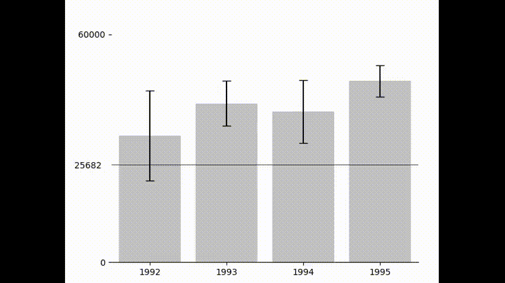

### Introduction

This is a simple interactive histogram that allows you to define two levels and see the
confidence that the mean for each bar lies in between these levels. As you hover over the 
plot, a horizontal line appears. Using these lines, you can define two levels. The color 
of the bars change depending on the confidence that the mean for each bar lies in between 
these levels.  


1. Clone the repository by executing the following command in the terminal  
```git clone
    git clone https://github.com/mathadoor/InteractiveHistogram.git
```
2. Change the directory to the cloned repository  
```cd InteractiveHistogram```
3. Create a virtual environment  
```python3 -m venv venv```
4. Activate the virtual environment  
```source venv/bin/activate```
5. Install the required packages  
```pip install -r requirements.txt```
6. Run the demo code by executing the following command in the terminal   
```python demo.py.``` or run the demo.ipynb notebook

